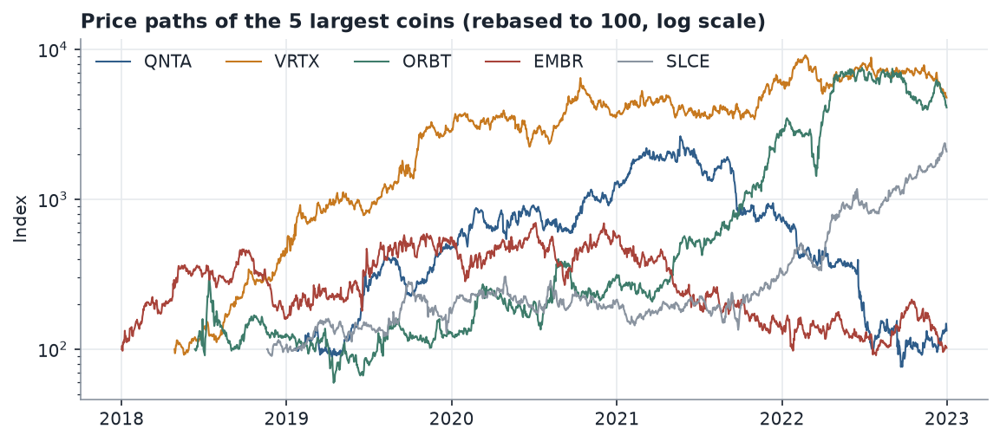
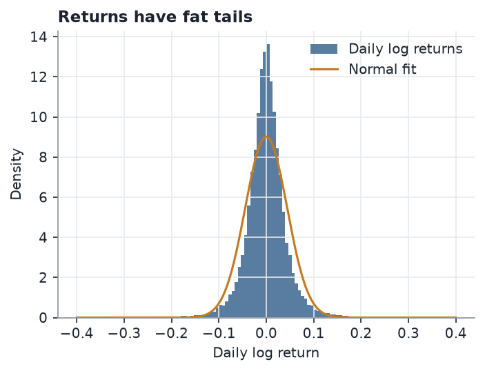
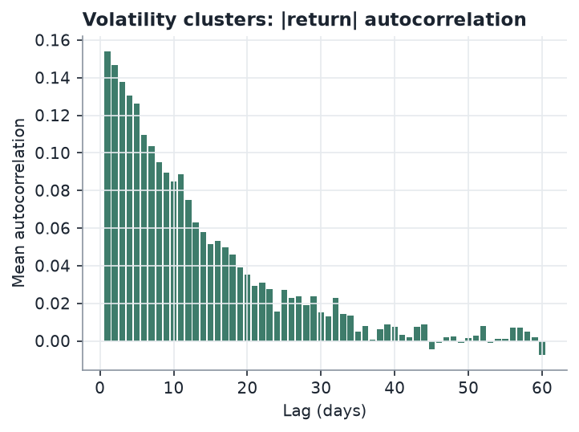
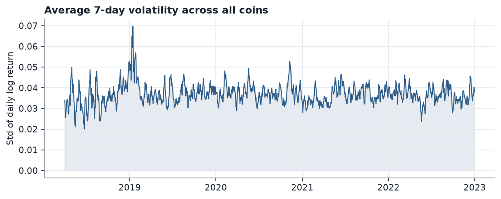
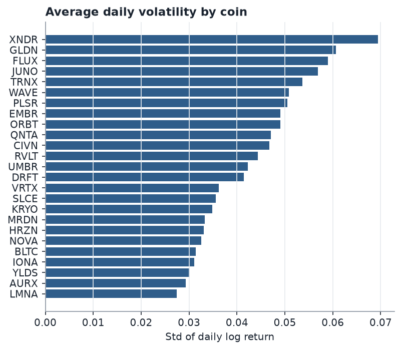
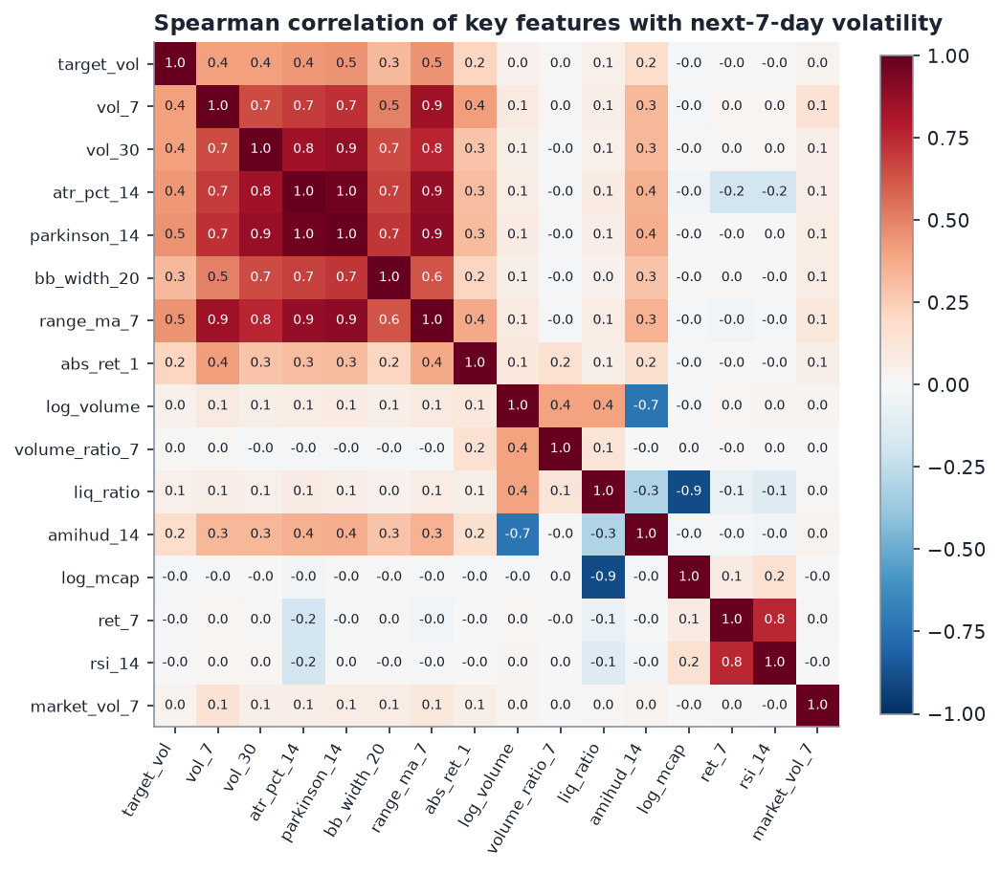
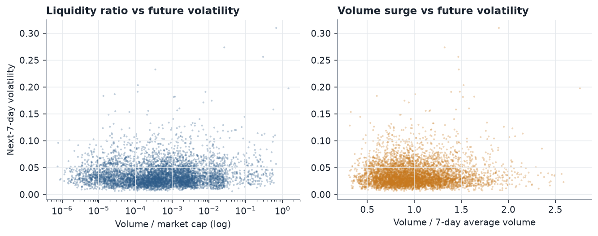
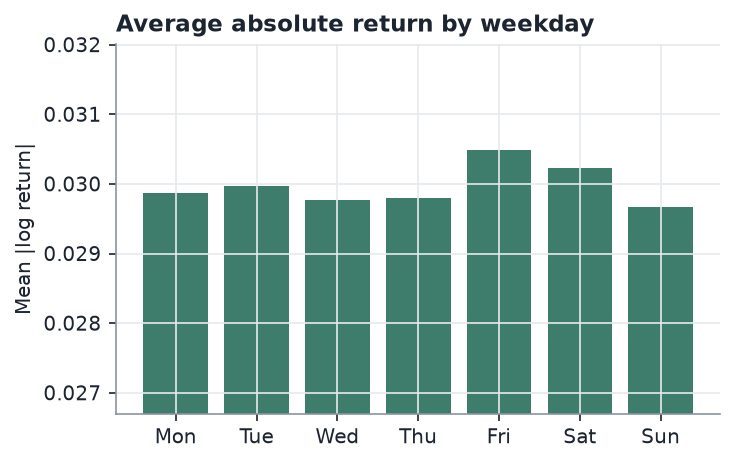
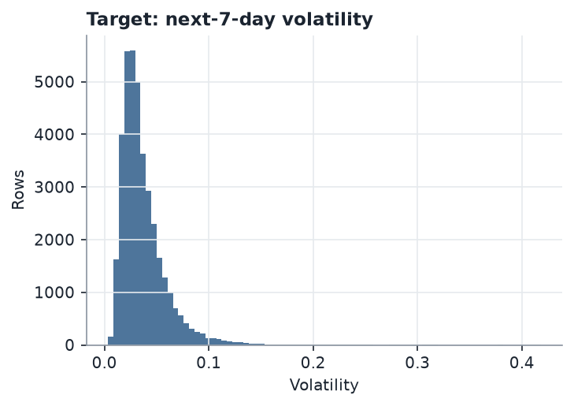

# Exploratory Data Analysis Report

> **Note:** the figures in this document were produced from the bundled synthetic demo dataset (fictional tickers), because the Kaggle file is not included in the repository. Put the real CSV files in `data/raw/` and run `python run_pipeline.py` to regenerate every number, table and chart from the real data.

## 1. Dataset summary

| Item | Value |
|---|---|
| Cryptocurrencies | 25 |
| Daily records (after cleaning) | 40,464 |
| Period | 2018-01-01 to 2022-12-31 |
| Columns | date, symbol, open, high, low, close, volume, market cap |
| Model-ready rows (after feature windows) | see `data/processed/features.csv.gz` |

Full per-column statistics are in `reports/eda_summary_stats.csv`; per-coin statistics are in
`reports/eda_per_coin_stats.csv`.

## 2. Data quality and cleaning

| Check | Result |
|---|---|
| Rows read | 40,384 |
| Duplicate (coin, date) rows removed | 40 |
| Non-positive prices set to missing | 0 |
| Rows with inconsistent High/Low repaired | 0 |
| Missing cells filled (forward fill, max 3 days) | 270 |
| Rows dropped (gap longer than 3 days) | 0 |
| Coins dropped (< 120 days of history) | 0 |
| Rows kept | 40,464 |

## 3. Price behaviour

Prices span several orders of magnitude between coins, so raw price levels are not comparable. All
volatility measures in this project are therefore built from **log returns** and price ratios, never
from price levels.

## 4. Returns are fat-tailed

Daily log returns have a standard deviation of 0.044, an excess kurtosis of 15.7 and
a skew of 0.13. 3.4% of all coin-days move more than 10%. A normal distribution
badly underestimates these extremes, which is why we predict volatility with flexible models and evaluate
on RMSE and MAE rather than assuming Gaussian errors.

## 5. Volatility clusters and is persistent

The average autocorrelation of absolute returns is 0.15 at lag 1 and still
0.02 at lag 30. Calm periods are followed by calm periods and turbulent
periods by turbulent ones. The correlation between the last 7 days' volatility and the next 7 days' volatility
is 0.51, which is why a "same as last week" forecast is a strong baseline that
the model has to beat.

Market-wide volatility peaked on 2019-01-14 (average 7-day volatility 0.070, versus a median of
0.037). Coins tend to become volatile together, so the model gets a market-wide volatility feature.

## 6. Differences between coins

Highest average daily volatility: XNDR (0.069), GLDN (0.061), FLUX (0.059).
Lowest: LMNA (0.027), AURX (0.029), YLDS (0.030).

## 7. Correlations

Features most correlated (Spearman) with next-7-day volatility: `parkinson_14` (0.45), `range_ma_7` (0.45), `atr_pct_14` (0.44), `vol_30` (0.41).
The volatility estimators are strongly correlated with each other, which is fine for tree models and is
handled by regularisation in the linear model.

## 8. Volume and liquidity

Liquidity ratio (volume / market cap) and volume surges are related to future volatility but much more
weakly than past volatility itself. They add information on top of the volatility features rather than replacing them.

## 9. Weekday effect

Average absolute return by weekday (Mon to Sun): 0.0299, 0.0300, 0.0298, 0.0298, 0.0305, 0.0302, 0.0297. Weekday is included as a
cyclical feature.

## 10. The target

Next-7-day volatility has a mean of 0.0371, a median of 0.0313 and is right-skewed
(skew 3.28; 5th to 95th percentile: 0.014 to 0.078). Because of the skew, the models
are trained on log(volatility) and converted back, so calm periods are not drowned out by spikes.

## 11. Takeaways

1. Volatility is persistent and clustered, so recent volatility is the strongest signal.
2. Returns are fat-tailed, so errors are judged on the original volatility scale (RMSE, MAE, R2).
3. Range-based estimators (Parkinson, Garman-Klass, ATR) use the intraday range and often carry information that close-to-close volatility misses.
4. Market-wide stress matters, so cross-coin features are included.
5. Chronological splitting is mandatory: shuffling would leak future volatility into training.
