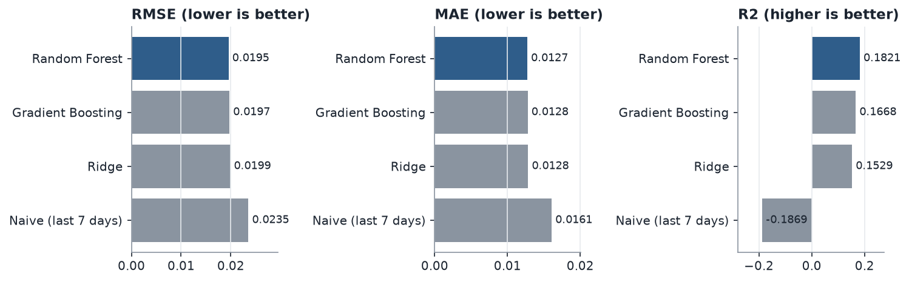
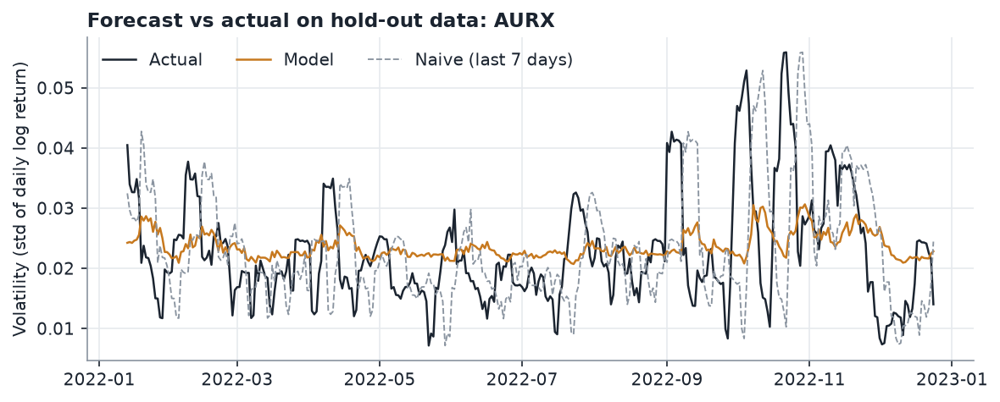
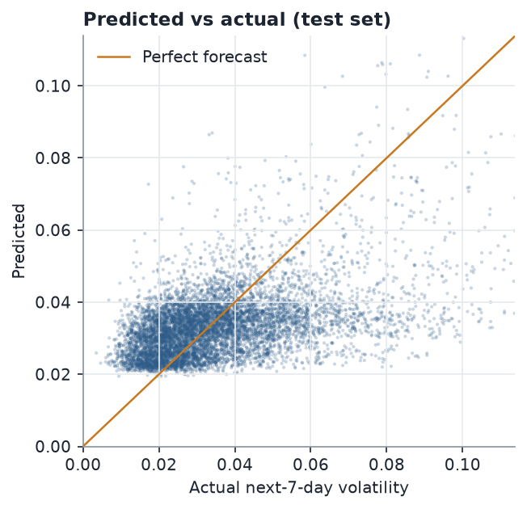
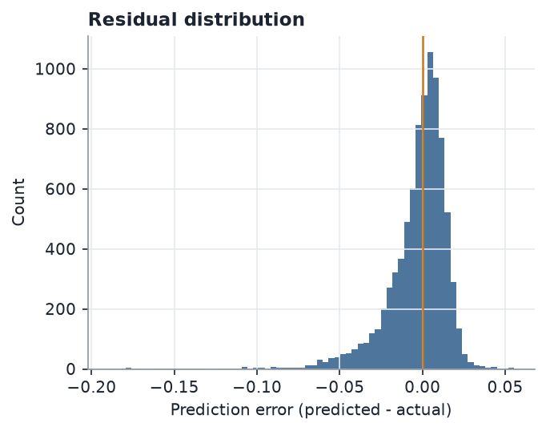
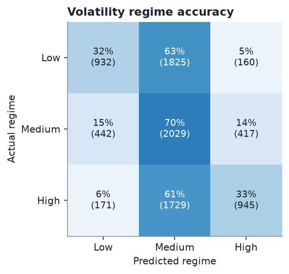
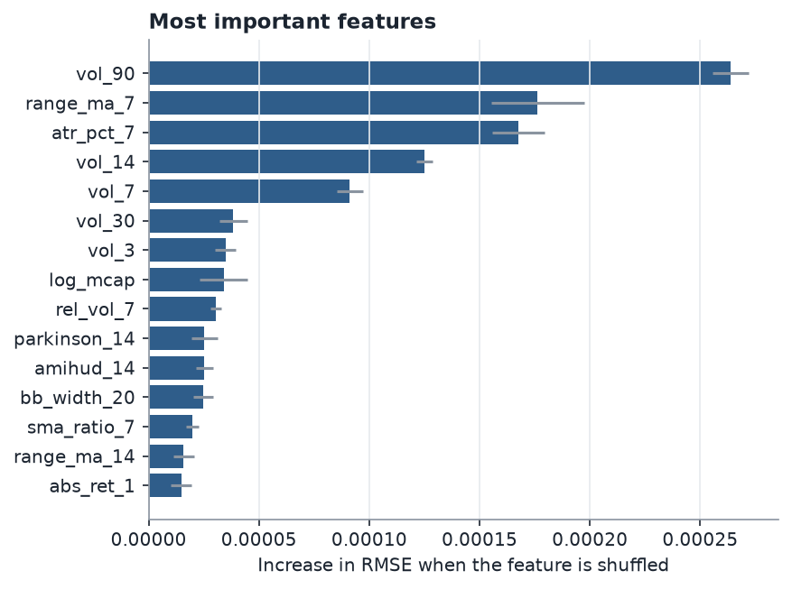

# Final Report: Cryptocurrency Volatility Prediction

> **Note:** the figures in this document were produced from the bundled synthetic demo dataset (fictional tickers), because the Kaggle file is not included in the repository. Put the real CSV files in `data/raw/` and run `python run_pipeline.py` to regenerate every number, table and chart from the real data.

## 1. Objective

Forecast how volatile each cryptocurrency will be over the next 7 days using only
information available today (OHLC prices, volume and market capitalisation). Volatility is measured as the standard
deviation of daily log returns. The forecast supports risk management, position sizing and spotting turbulent periods early.

## 2. Data

25 coins, 40,464 daily records, 2018-01-01 to 2022-12-31. Cleaning removed duplicates,
repaired inconsistent High/Low values, forward-filled short gaps and dropped coins with too little history
(details in the EDA report).

## 3. Method


**Features.** 42 engineered features in nine groups: returns, rolling volatility, range-based volatility
(Parkinson, Garman-Klass, ATR), Bollinger Bands, trend and momentum, volume and liquidity, size, calendar and
market-wide context. See `docs/FEATURES.md`.

**Target.** Realised volatility over days t+1 to t+7.

**Preprocessing.** Standard scaling (fitted on training data only), clipping at 8 standard deviations, and a log transform
of the target.

**Splitting.** Strictly chronological, with a 7-day gap before each boundary so no training target overlaps a
later period.

| Set | From | To | Rows |
|---|---|---|---|
| Train | 2018-04-01 | 2021-07-16 | 24,889 |
| Validation | 2021-07-24 | 2022-01-05 | 4,150 |
| Test | 2022-01-13 | 2022-12-24 | 8,650 |

**Models.** Ridge regression, Random Forest and Gradient Boosting, each tuned with randomised search and forward-chaining
cross-validation on the training set, compared against a naive baseline (next week's volatility = last 7 days' volatility). The
winner was picked on the validation set. All candidates were then refitted on train + validation and scored **once** on the untouched test set.

## 4. Results

Selected model: **Random Forest** (max_depth = 9, max_features = 0.2541, min_samples_leaf = 26).

| Model | RMSE | MAE | R2 |
|---|---|---|---|
| Random Forest | 0.0195 | 0.0127 | 0.1821 |
| Gradient Boosting | 0.0197 | 0.0128 | 0.1668 |
| Ridge | 0.0199 | 0.0128 | 0.1529 |
| Naive (last 7 days) | 0.0235 | 0.0161 | -0.1869 |



On the hold-out test period, Random Forest has an RMSE of 0.0195, an MAE of 0.0127 and an R2 of 0.182.
Compared with the naive baseline (RMSE 0.0235), it beats the baseline, with RMSE
reduced by 17.0%.



 

### Volatility regimes

Forecasts were also bucketed into Low, Medium and High volatility using training-set terciles
(thresholds 0.0254 and 0.0391). The model puts a coin in the
correct regime 45.2% of the time (random guessing would give about 33%).



### What drives the forecast



Permutation importance on the test set ranks `vol_90`, `range_ma_7`, `atr_pct_7`, `vol_14`, `vol_7`, `vol_30`, `vol_3`, `log_mcap` highest (features that raise RMSE most when shuffled).

### Accuracy by coin

Lowest RMSE: AURX (0.0092), LMNA (0.0110), YLDS (0.0114).
Highest RMSE: XNDR (0.0280), GLDN (0.0328), QNTA (0.0354).
Full table: `reports/per_coin_metrics.csv`.

**Read the R2 carefully.** The pooled R2 above (0.18) mixes two things: telling calm coins from wild coins, and
timing when a single coin gets calmer or wilder. Inside individual coins the median R2 is 0.03 and it is positive for
15 of 25 coins. So a large part of the pooled score comes from ranking coins by their usual volatility level, and the
week-to-week timing signal is smaller. RMSE and MAE per coin are the fairer view of within-coin accuracy.

## 5. Key insights

1. Volatility is persistent and clustered (correlation between last week's and next week's volatility: 0.51), which is what makes it forecastable at all, unlike returns.
2. The naive "same as last week" forecast is the bar to beat. Random Forest beats it, with RMSE lower by 17.0%. The gain likely comes from blending several volatility estimators with volume, liquidity and market-wide context, and from shrinking noisy 7-day readings toward each coin's longer-run level.
3. Errors are largest for coins with the highest volatility (XNDR, GLDN, QNTA) and, as with any price-based model, around sudden shocks that history cannot anticipate.
4. Volatility level (Low / Medium / High) is coarser than an exact forecast, and is often the more practical output for risk monitoring. Accuracy here is 45% against about 33% for guessing.

## 6. Limitations

- Forecasts use only price, volume and market cap. News, regulation, on-chain data and macro events are not included.
- Daily data cannot capture intraday volatility.
- Sudden shocks (exchange failures, regulatory news) are unpredictable from history.
- The model was evaluated on one hold-out period; performance in a very different market regime may differ.
- Nothing here is financial advice.

## 7. Possible next steps

Add a GARCH benchmark and an LSTM or temporal CNN, include sentiment and on-chain features, forecast several horizons (1, 7, 30 days),
and predict intervals (quantile regression) instead of a single number.

## 8. Reproducing

```
pip install -r requirements.txt
python run_pipeline.py
streamlit run app/streamlit_app.py
```
