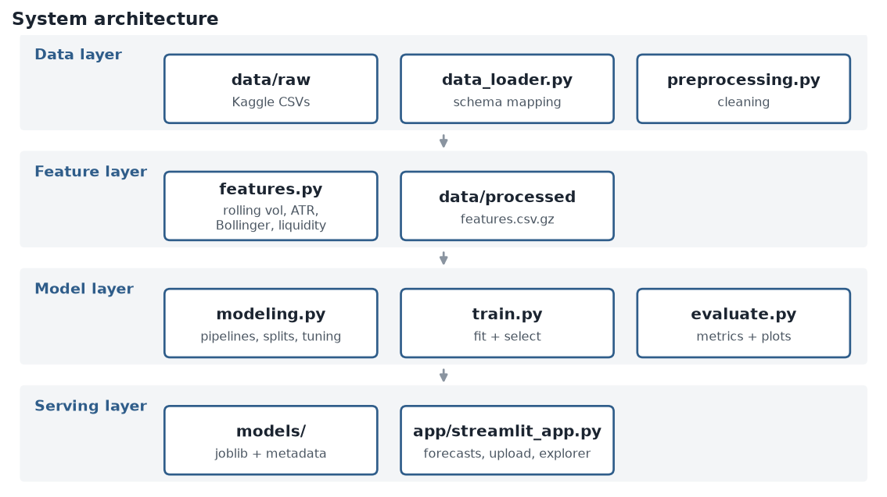

# High-Level Design (HLD)

## 1. Purpose

Predict how volatile a cryptocurrency will be over the next 7 days from its daily OHLC prices, volume and
market capitalisation, and make the forecast available through a simple web app.

## 2. Scope

| In scope | Out of scope |
|---|---|
| Daily data for many coins | Intraday / tick data |
| Volatility level forecast (a number) and regime (Low / Medium / High) | Price direction or trading signals |
| Local deployment with Streamlit | Production hosting, authentication, live data feeds |

## 3. Architecture



The system has four layers. Each one only talks to the layer above it, and the layers communicate through files
(CSV / joblib / JSON), so each can be run and tested on its own.

| Layer | Responsibility | Main files |
|---|---|---|
| Data | Read Kaggle CSVs, map column names, clean | `data_loader.py`, `preprocessing.py` |
| Feature | Turn cleaned prices into model inputs and the target | `features.py` |
| Model | Split by time, tune, compare, evaluate, save | `modeling.py`, `train.py`, `evaluate.py` |
| Serving | Load the saved model and show forecasts | `app/streamlit_app.py` |

Supporting modules: `config.py` (all settings), `eda.py` (analysis and charts), `report_builder.py` (fills the reports with real numbers),
`diagrams.py`, `generate_demo_data.py`.

## 4. Key design decisions

| Decision | Reason |
|---|---|
| Target is realised volatility (std of daily log returns) over the next 7 days | It is what risk managers need, and it is directly measurable from the data |
| Chronological train / validation / test split with a 7-day gap | Prevents future information leaking into training; the target window looks 7 days ahead |
| Models predict log(volatility) | Volatility is right-skewed and always positive |
| Scaling is inside the model pipeline | The scaler is fitted on training data only |
| Compare against a naive baseline (last 7 days' volatility) | Volatility is persistent; a model is only useful if it beats "same as last week" |
| One model for all coins with market-wide features | Far more training rows than a model per coin, and captures market stress |
| Selection on validation, one final test | The test set is never used to choose or tune anything |

## 5. Data flow (summary)

Raw CSV -> cleaned daily table -> feature table with target -> chronological split -> tuned models -> best model + metadata ->
Streamlit app. See `PIPELINE.md` for detail.

## 6. Deployment view

```
Developer machine / Streamlit Community Cloud
  |- Python 3.10+ with requirements.txt
  |- models/volatility_model.joblib   (loaded once, cached)
  |- data/processed/features.csv.gz   (loaded once, cached)
  '- streamlit run app/streamlit_app.py
```

No database or external service is needed. The app needs the two artefacts above, which are committed to the repository.

## 7. Non-functional considerations

| Area | Approach |
|---|---|
| Reproducibility | Fixed random seed, all settings in `config.py`, one command (`run_pipeline.py`) |
| Performance | Whole pipeline runs in minutes on a laptop; the app answers instantly from cached data |
| Maintainability | Small single-purpose modules with docstrings |
| Robustness | Loader accepts different column names; the app shows readable errors for bad uploads |
| Honesty | Reports state the hold-out period and limitations; the app marks the part of history the model was trained on |

## 8. Risks

| Risk | Mitigation |
|---|---|
| Market regime changes make the model stale | Re-run the pipeline on fresh data; monitor error on new data |
| Data quality issues | Cleaning step with a logged report |
| Over-interpretation of forecasts | Limitations in the report and the app; not financial advice |
