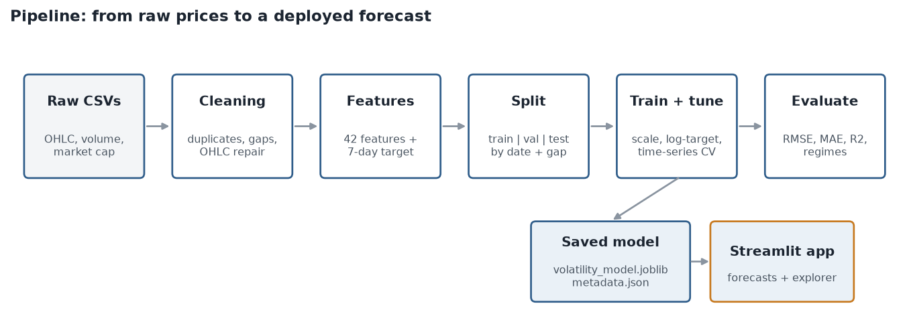

# Pipeline Architecture



Run everything with `python run_pipeline.py`. Each stage writes its output to disk, so a stage can be re-run alone.

| # | Stage | Input | Output | Code |
|---|---|---|---|---|
| 1 | Load | `data/raw/*.csv` | one raw table | `data_loader.load_raw` |
| 2 | Clean | raw table | `data/processed/clean_data.csv.gz`, `reports/cleaning_report.json` | `preprocessing.clean` |
| 3 | Features | clean table | `data/processed/features.csv.gz` | `features.build_features` |
| 4 | EDA | clean + feature tables | `reports/figures/eda_*.png`, `reports/eda_summary.json` | `eda.run` |
| 5 | Split | feature table | train / validation / test (by date, with a 7-day gap) | `modeling.chronological_split` |
| 6 | Tune and select | train, validation | best model per family, validation scores | `train.main` |
| 7 | Final fit and test | train + validation, test | test metrics, predictions | `train.main` |
| 8 | Save | fitted model | `models/volatility_model.joblib`, `models/metadata.json` | `train.main` |
| 9 | Reports | metrics and summaries | `docs/EDA_REPORT.md`, `docs/FINAL_REPORT.md`, `docs/FEATURES.md` | `report_builder.build` |
| 10 | Serve | model + features | Streamlit app | `app/streamlit_app.py` |

## Data flow in detail

```
raw CSV (date, symbol, O, H, L, C, volume, market cap)
  -> normalise column names, parse dates and numbers
  -> remove duplicates, repair OHLC, fix impossible values
  -> daily calendar per coin, forward fill up to 3 days, drop long gaps and short-history coins
  -> per-coin features from data up to day t + market-wide features
  -> target: std of log returns over days t+1 ... t+7
  -> split by date:  train | 7-day gap | validation | 7-day gap | test
  -> StandardScaler (fit on train) -> clip -> model -> exp()   [log target]
  -> tune with forward-chaining CV -> choose on validation
  -> refit on train + validation -> score once on test
  -> save model + metadata -> app predicts on the latest row of every coin
```

## Preventing data leakage

1. Features at day t only use days up to t.
2. The split is by calendar date, never shuffled.
3. A 7-day gap separates the sets because targets look 7 days ahead.
4. Cross-validation uses `TimeSeriesSplit` with a matching gap.
5. The scaler is part of the model pipeline and is fitted on training rows only.
6. Model choice uses the validation set; the test set is scored once.

## Inference path (app)

1. Take the latest feature row for the chosen coin (or build it from an uploaded CSV using the same cleaning and feature code).
2. The saved pipeline scales the row, predicts log-volatility and converts it back.
3. Compare with the regime thresholds stored in `metadata.json` to show Low / Medium / High.

## Re-training on new data

1. Replace or add CSVs in `data/raw/`.
2. Run `python run_pipeline.py`.
3. Commit the updated `models/`, `data/processed/features.csv.gz` and `docs/`.
